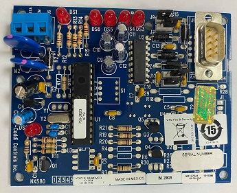
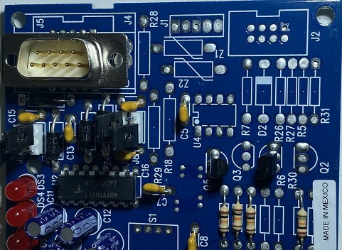
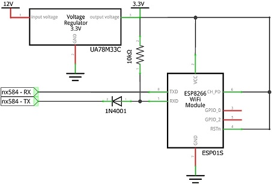

# nx584-esp01s
In this project add to nx584e wifi module ESP01S.

With ESP01S make a serial to wifi server. 
After that can connect to alarm control panel via wifi from Home Assistant with pynx584 pakage(https://github.com/kk7ds/pynx584).

# First remove the stickers

# Remove the stickers
